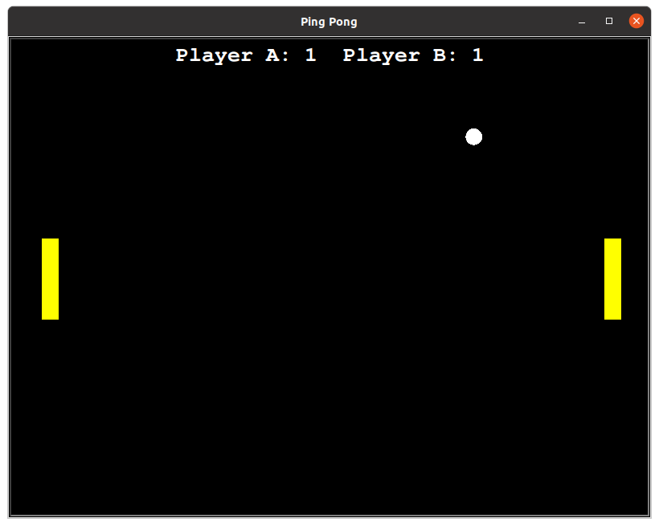
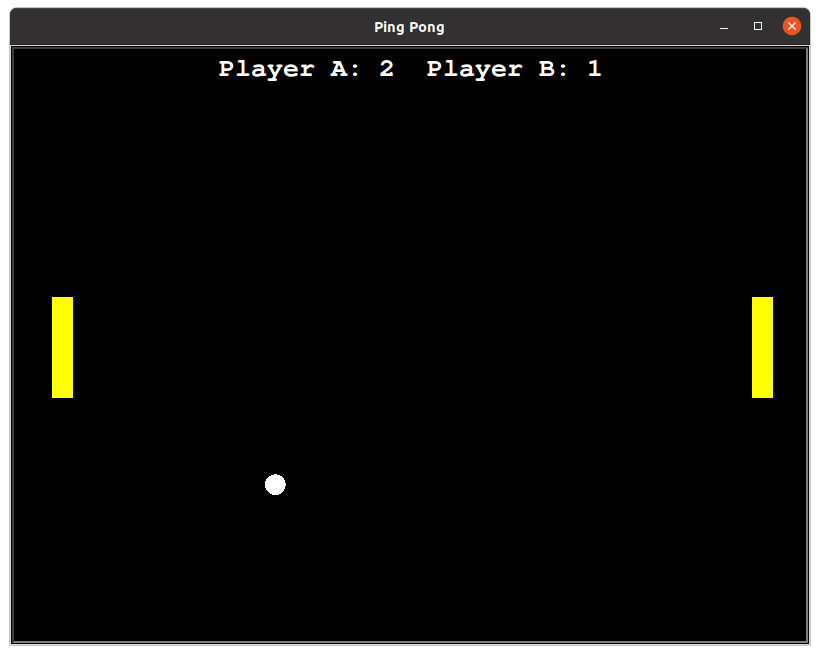
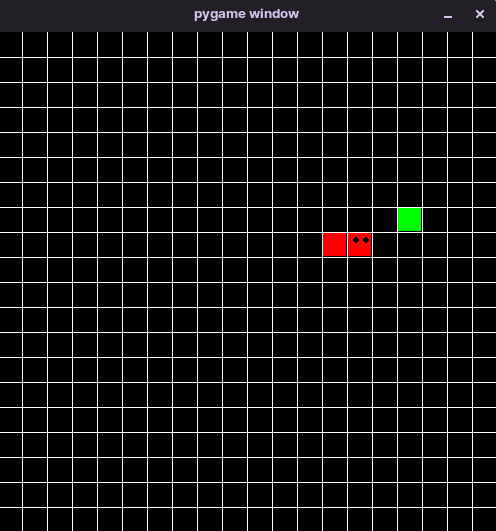

This repository contains to 2 games one made using turtle module and other using Pygame module. The games are a bit shabby and the only reason to making them was to learn how to use these modules.

# **2 Player Ping-Pong Game**

This game is made using python turtle module

It's a 2 player game

* Player A:
    * `w` key for moving left paddle up.
    * `s` key for moving left paddle down.

* Player B:
    * `Up` key for moving right paddle up.
    * `Down` key for moving right paddle down.

There is scoreboard which maintains the score.  

* #### It's a never ending game. (which can be changed if needed easily).

 # **Snake Game** 

 This is the normal snake game which you might have played in phone.
 Rules are the same and final score shows up on the terminal screen.

You need to have pygame module installed to run this game.

